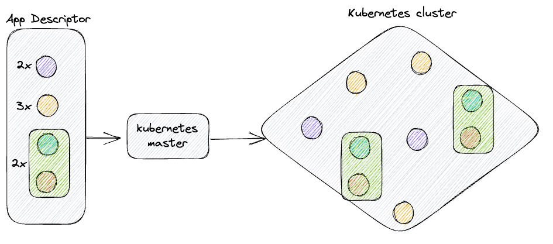
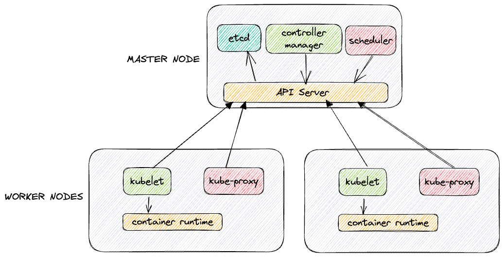
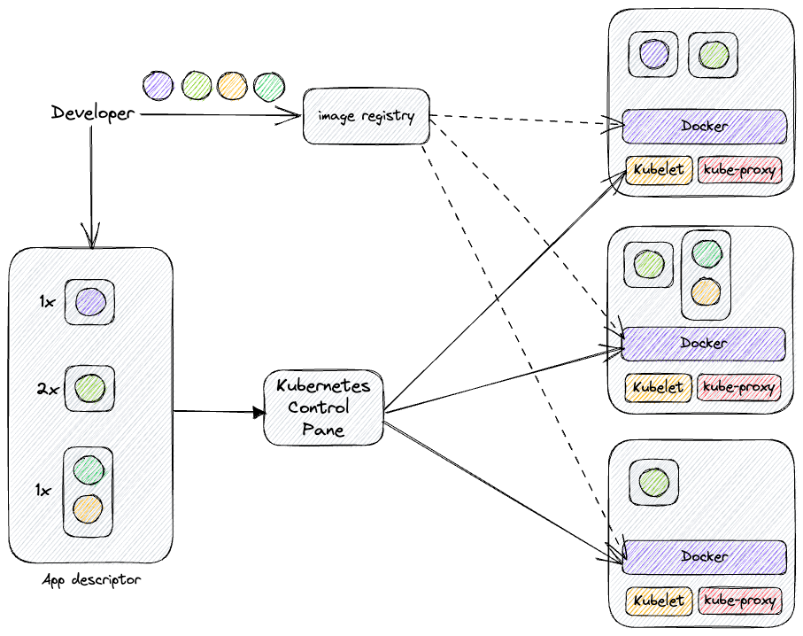

# Introduction to Kubernetes

## What is Kubernetes
Kubernetes is a software system that permits to manage the lifecycle of applications, encapsulating them in a atomic
structure named containers. Kubernetes uses the logic behind the **Linux containers** to virtualize the physical and 
logical internal details of the host machine. This make the programmer's job easier as it automates the deployment 
of applications within a dedicated cluster, but also permits to isolate each application in a wide multinode environment. 
These feature permits to define a standard configuration that can be used to deploy a cluster also in cloud providers' 
environment, without changing the infrastructural view.  
Kubernetes permits to run the applications on a cluster of several physical nodes as they were deployed on a single
monolithic computer, abstracting the low-level infrastructure and connectivity but making the way applications are 
deployed remain the same, allowing installation in the same way either on a cluster of one node and on thousands nodes.

## High-level structure of Kubernetes system
An high-level view of the system is the following:  

  

The system is structured with a **master node** and a number of **worker nodes**. The developer or the DevOps define a 
list of application to be used, the number of replicas for each one and, eventually, if some of them must run together,
and pass it to the master node as a dedicated resource called **app descriptor**. Kubernetes analyze the application 
descriptor and deploy the applications on the worker nodes, as described in the instructions. But the app descriptor 
does not describe how the application must be distributed on nodes: it is the job of Kubernetes master node to define 
where the component lands on deploy and maintenance.
Kubernetes can be viewed as an operating system for the cluster, on which the developer will not handle the 
infrastructure and the optimization operations on the environment, such as scaling, load-balancing, self-healing and so on.

## Low-level structure of Kubernetes system
A low-level view of the system is the following:  

  

At the hardware level, a Kubernetes cluster is composed of many nodes, splittable in, **Master node**and **Worker nodes**.  
A *master node* hosts the **Kubernetes Control Pane** that permits to manage the Kubernetes system and the cluster environment, 
making it function. It is composed of many components:
 - **Kubernetes API Server**: permits the communication between the master node and the worker nodes or another client.
 - **Scheduler**: permits to schedule the applications, assigning them a worker node.
 - **Controller manager**: permits to execute the cluster-level operations (such as replication), keeping track of all worker nodes and occurred events.
 - **etcd**: permits to store the cluster configuration persistently in a distributed data storage.

A *worker node* hosts the application to run in the cluster. It is composed of many components:
 - **Container runtime**: such as Docker, rkt and so on, permits to run the containerized application
 - **Kubelet**: permits to managing the containers in the node and communicating with the master node through API server
 - **Kubernetes Service Proxy**: also known as **kube-proxy**, permits to load-balancing the network traffic between application components  

## Running applications' workflow in Kubernetes
In order to run an application in Kubernetes cluster, the same application must be packaged in one or multiple container
images, pushing them in a **image registry** and post a description for this app in the *Kubernetes API Server*. The description
must includes some needed information such as the container image to be used to generate the application, the co-location
of the application in a node, the relation between the components and so on. For each component, the developer must define also
the number of **replicas** to be generated, the exposition on external or internal IPs and other configuration on single
components.  
When the API server analyze the app descriptor, it instructs the Scheduler to define the scheduling of the deploying of 
one or more groups of containers, analyzing the needed resources and setting the available worker nodes to be used on
installation. Then, the Kubelet component tells to the **container runtime** to pull the container images required to
generate and run the container instance.  

As described in the image, the app descriptor define four different container on three different set, called **pod**: two 
with single component and one with two co-located container that are not isolated each other. In the app descriptor is defined
also the number of replicas for each pod that are needed to be run in parallel. After the submission of the app descriptor,
the Scheduler schedule the defined number of replicas for each pod on the available nodes and, then, the Kubelets on the
nodes tells to the container runtime to get the needed image from image registry.  
Once the application are running, Kubernetes makes sure that all the components are in a valid deploy state and that matches
the defined information defined by the developer in the app descriptor.

### TO-DO
 - Add info about kubectl
 - Add scripts for kubectl as high-level reference and add references to @Angelo's scripts 
   - kubectl cluster-info
   - aks|aws cluster creation
   - kubectl get nodes
   - kubectl run (and describe replication controller, take account od Figure 2.8)
   - kubectl expose
   - kubectl get services