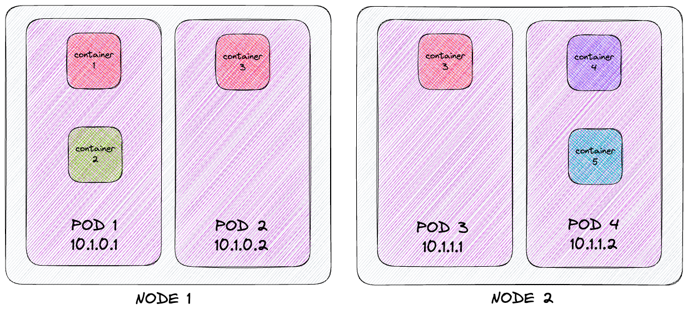
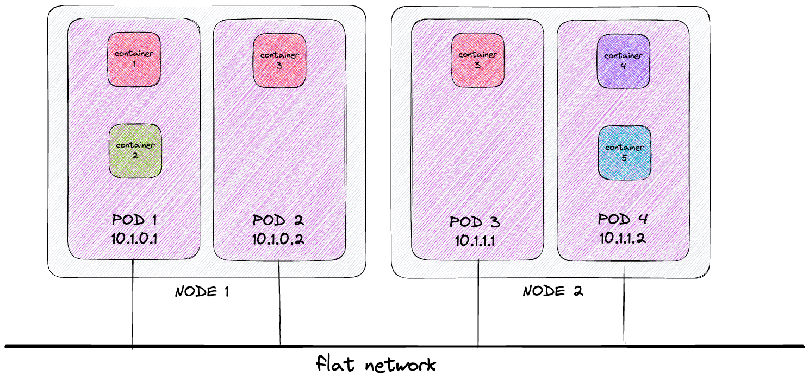

# Pods

## What is a pod?
Container are designed to ideally run and handle only a single process (unless the process generate child processes),
isolating them from the rest of the cluster. So, if there are multiple unrelated process, one can think that containers
cannot communicate each other from two different nodes. But this is not true, because there is an high-level structure,
called **pod**, that permits to encapsulate containers, binding them as a single unit.  
So, a pod is a collection of one or more containers that runs on the same worker node (co-location). They are associate to 
the same Linux namespace and can be referred as a separate machine (logically speaking), so with a specific network 
address, processes, resources, and so on. The pod can be either a single application with a single process or 
an union of multiple applications, each one with multiple processes, that run on its own container but all runs on the
same node. A hierarchical structure of the structure of infrastucture is the following:  



## Pod networking
All the containers of a pod run under the same network and Linux namespace, so they share the same hostname and network
interface and can communicate each other through IPC (inter-process communication). But they cannot use a common filesystem
directly and by default. This because each container filesystem comes from container image and this one is fully isolated
and cannot be reached by another container. For accomplish a common storage space, it can be used the concept of **volume**.  
Due to the fact that container in a pod runs on the same network, they share the same IP address and port set and can 
communicate using a same network interface through localhost. So, the ports used by different processes must not overlap 
each other or this can cause a ports conflict. This is applied only for containers of the same pod: for containers of 
different pods, this is not a problem because each pod has a separate port space.  
All pods in a cluster are contained in a single shared network, so they can communicate each other without routing to
external context. The pods can communicate each other using directly the other pod's IP, without the needing of a NAT
gateway that translate a logical address to the real one. So, the communication between pods is always simple, even if 
the pods are located in different nodes.



A great advantage of the pod isolation is the possibility to the separation of concerns. The isolation permits to separate
the different applications into separated pods, on which the Kubernetes Control Pane can execute a different handling. For
example, a more memory-intensive application (i.e. a backend application) can be separated in a totally different pod 
from a less eager one (i.e. a frontend application) in order to reduce speed-down issues.  
In this case, the **scaling** operation can be executed more easily, permitting a different approach of replication for
the two applications on different moments and cases.

## Pod descriptor
As is the case of other Kubernetes resource, pods can be created using JSON or YAML manifest document that will be 
passed to the Kubernetes Rest API endpoint.  
The pod definition consists of few main parts:
 - Metadata: including name, namespace, labels and other information about the pod
 - Specifications: including description of pod contents such as container, volume and so on
 - Status: including the current information about the running pod and each container located into it.

A simple structure of a descriptor can be the following:
```yaml
apiVersion: v1               (K8s API version)
kind: Pod                    (Descriptor for Pod instance)
metadata:
  name: pod-example-label    (Metadata)
spec:
  containers:
  - image: image/name        (Name of the image)
    name: container-name     (Name of the container)
    ports:
    - containerPort: 8080    (Port where the container will be exposed)
      protocol: TCP
```

## Interfacing with pods
To create a pod starting from the descriptor, execute this command:  

`$ kubectl create -f POD-NAME.yaml`  

The same structure (with additional fields) can be retrieved after the pod creation with the command:  

`$ kubectl get po POD-NAME -o EXT`  

where `EXT` can be either *json* or *yaml*. For simply retrieve the list of pods, execute the command:  

`$ kubectl get pods`  

When is needed to talk directly with a specific pod without calling an exposed service, a port forwarding can be 
configured on the pod. To do so, execute the command:  

`$ kubectl port-forward POD-NAME MACHINE-LOCAL-PORT:POD-PORT`  

where the `MACHINE-LOCAL-PORT` is the port that can be used in local environment to access the pod directly.
It is also possible to remotely run a command inside an existing pod. This can be useful when is needed to examine
the pod status, environment or content. For doing so, execute the command:

`$ kubectl exec POD-NAME -- COMMAND-TO-BE-EXECUTED`

where `COMMAND-TO-BE-EXECUTED`, after the double dash, is the command that will be executed on the chosen pod. So, this
can be a simple `curl` command or another more complex command flow. Finally, for destroying the generated pod:

`$ kubectl delete po POD-NAME`

Deleting the pod mean that all the containers located in this resource will be terminated with a `SIGTERM` signal. After
the signal sending, Kubernetes waits a certain amount of seconds (30 by default) for shut it down *gracefully* and if
it does not shut down in this timelapse, the process will be killed by `SIGKILL` signal.


## Labelling resources
In some cases, there can be multiple pods on a cluster, either totally different ones, from the same replica, with different 
version and so on. In order to grouping them avoiding an incomprehensible mess, they can be tagged with **labels**.  
A label is a Kubernetes feature that permits to organize all resources using a key-value pair attached to the sames.  
The labels can be defined either in resource creation and in a dedicated update, without recreating the resource.  
In order to create a label on the resource, a descriptor can be defined with the following fields:  
```yaml
apiVersion: v1               
kind: resource               
metadata:
  name: pod-example-label    
  labels:
    key1: value1
    key2: value2
spec:
  containers:
    ...
```
A subset of all labels can be shown in the pod list with the command:  

`$ kubectl get po -L label1,label2`

Alternatively, the whole list of labels can be shown with the command:

`$ kubectl get pods --show-labels`

Obviously, the label can be used also as search filters as well as organizing group. This functionality is called 
**label selectors** and permits to select resource based on whether the resource:
 - Contains/not contains a label with certain key
 - Contains a label with certain pair key-value
 - Contains a label with certain key an a value not equals to the one specified

For doing so, it can be used the following commands:

`$ kubectl get po -l label1=value1`
`$ kubectl get po -l '!label1'`
`$ kubectl get po -l label1 in (value1,value2)`

## Annotations
Kubernetes resources can have also **annotations**, i.e. a key-value pairs similar to pairs but that cannot holds 
static information, so they cannot be used to group objects. The advantage made by annotation is that they can hold much
larger information that can be used as a tool.  
The annotation are used for adding descriptions for resources that can be visible to everyone that can access to cluster.
For instance, a valid annotation can be the developer that created the resource.  
In order to create an annotation on the resource, a descriptor can be defined with the following fields:
```yaml
apiVersion: v1               
kind: resource               
metadata:
  name: pod-example-label    
  annotations:
    kubernetes.io/created-by: |
      {"kind":"SerializedReference", "apiVersion":"v1", "reference":{"kind":"ReplicationController", ...
spec:
  containers:
    ...
```
The annotation can be added on already generated resource with the command:

`$ kubectl annotate pod POD-NAME VALUE-ANNOTATED=COMPLEX-VALUE`

## Namespace for grouping
It is possible to define a certain component in order to define a context on which the resource can be located and can
be naturally grouped: this is called Kubernetes **namespace** (different from Linux namespace that are used to really isolate
processes and resources). The namespace can be used in a variety of forms: for separating resources in a multi-tenant
environment, separating a complex system in a more simple applicative context, defending resources from unwanted access 
and so on.  
But it is important to know that resource in different namespace does not mean necessarily that they cannot communicate
each other. They are not isolated as real Linux namespaces and if they are not isolated from the network, they can be
freely invocable and accessible by other resources.  
For see all the used Kubernetes namespaces, the following command can be launched:

`$ kubectl get ns`

Using one of the listed namespaces, one or more pods located here can be viewed as follows:

`$ kubectl get po --namespace NAMESPACE`

As well as other resources, the namespace can be generated with dedicated descriptor:
```yaml
apiVersion: v1
kind: Namespace                  (Descriptor of Namespace instance)
metadata:
  name: namespace-name           (Metadata)
```
The descriptor can be used for generating the resource passing as parameter to the command:

`$ kubectl create -f NAMESPACE-NAME.yml`

After the creation of the same namespace, the resource to be generated can be attached to the namespace:

`$ kubectl create -f RESOURCE-NAME.yaml -n NAMESPACE-NAME`  

For deleting the whole namespace with all the resources included in there:

`kubectl delete ns NAMESPACE-NAME`
