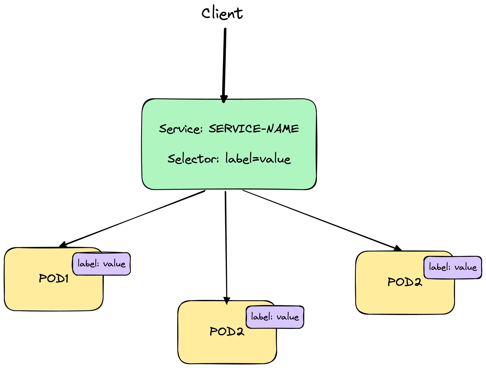
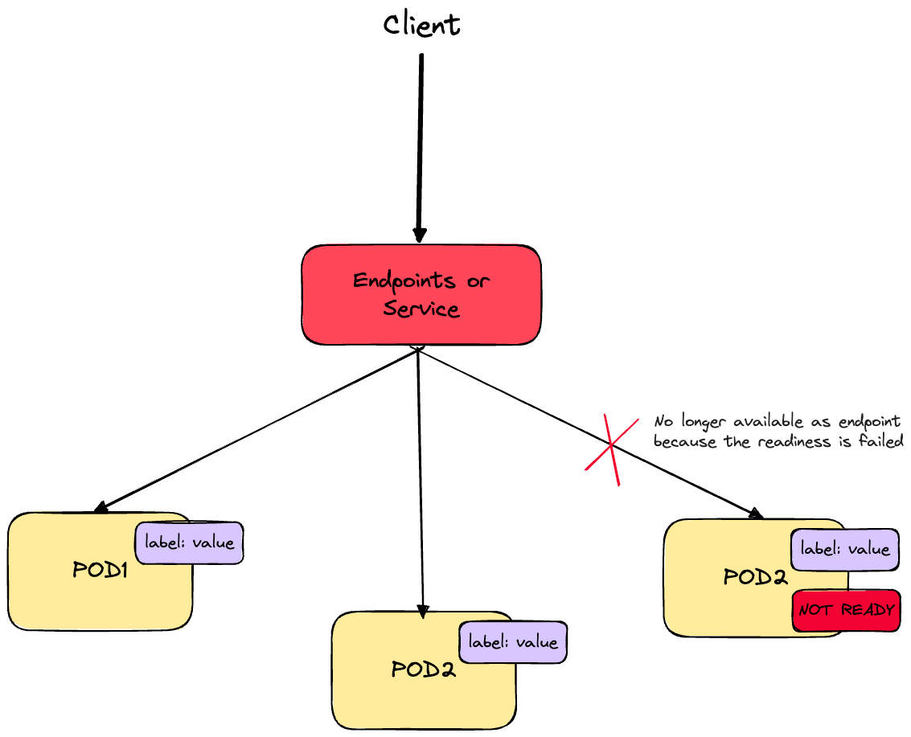
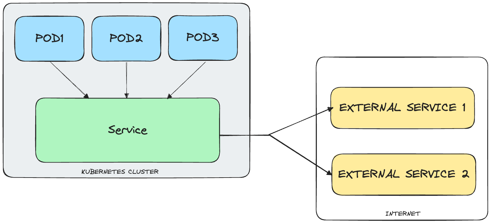
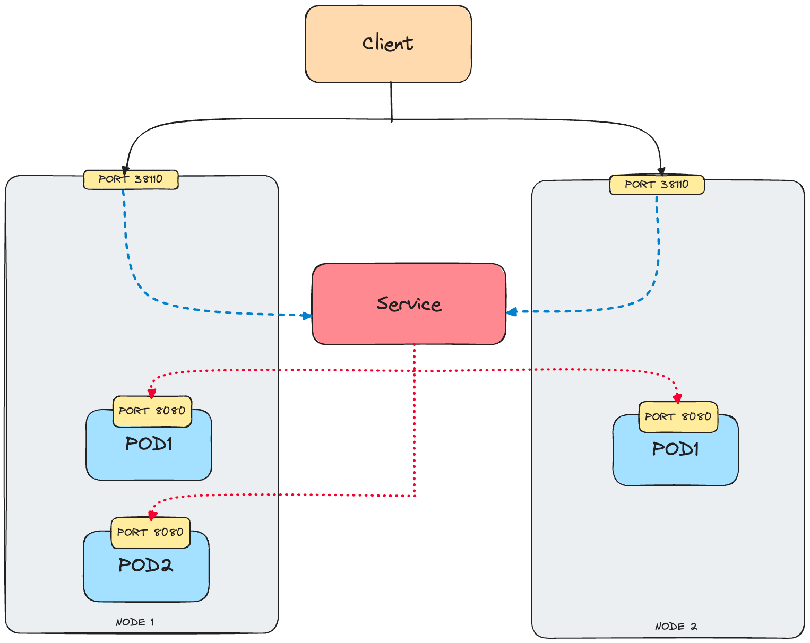
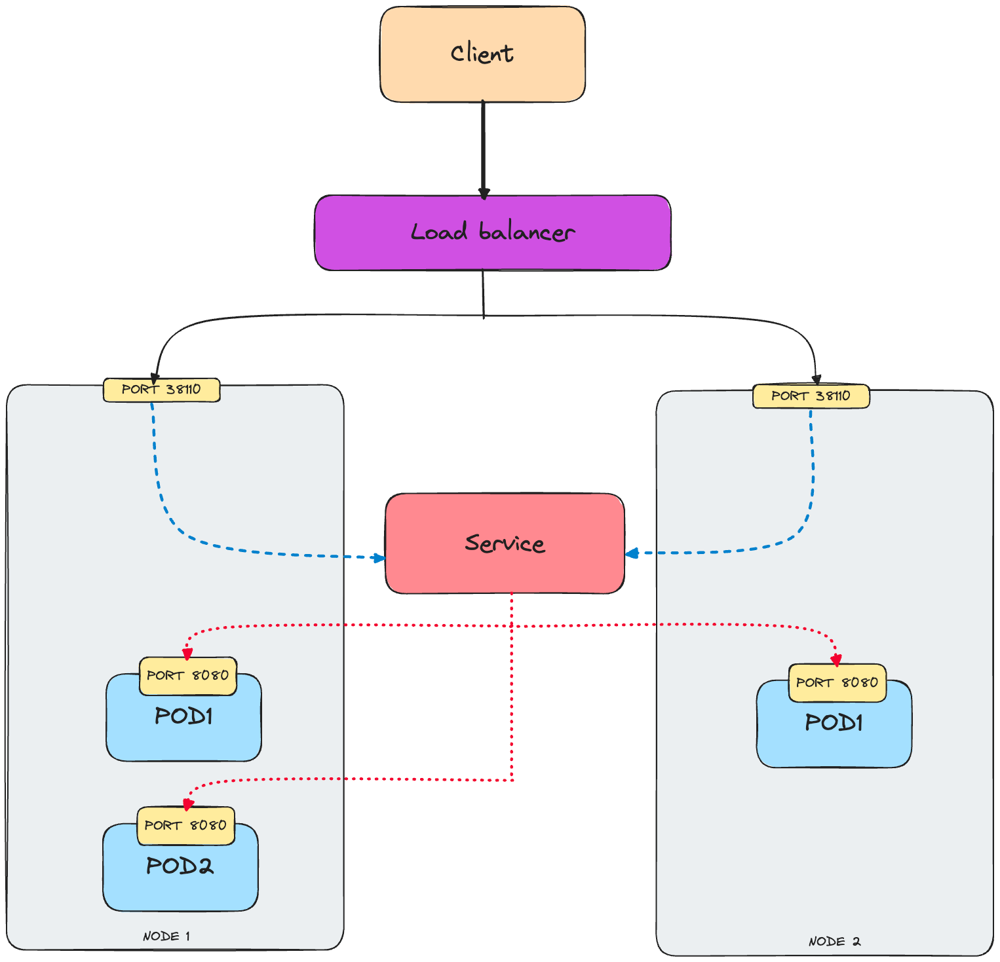
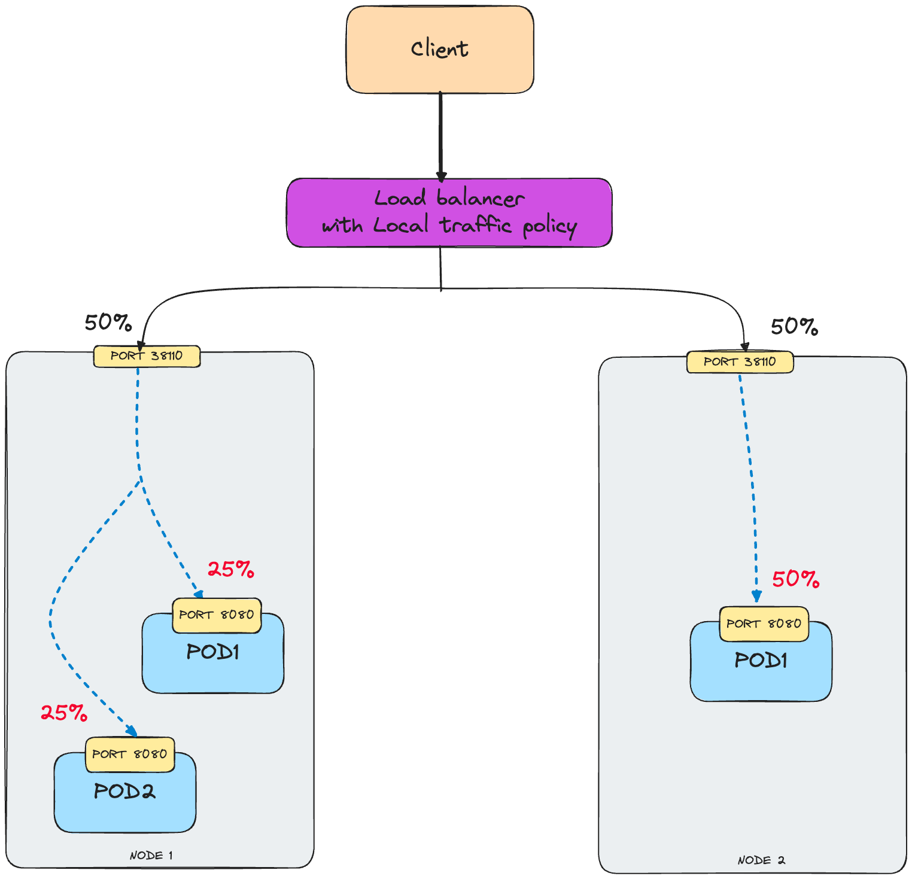
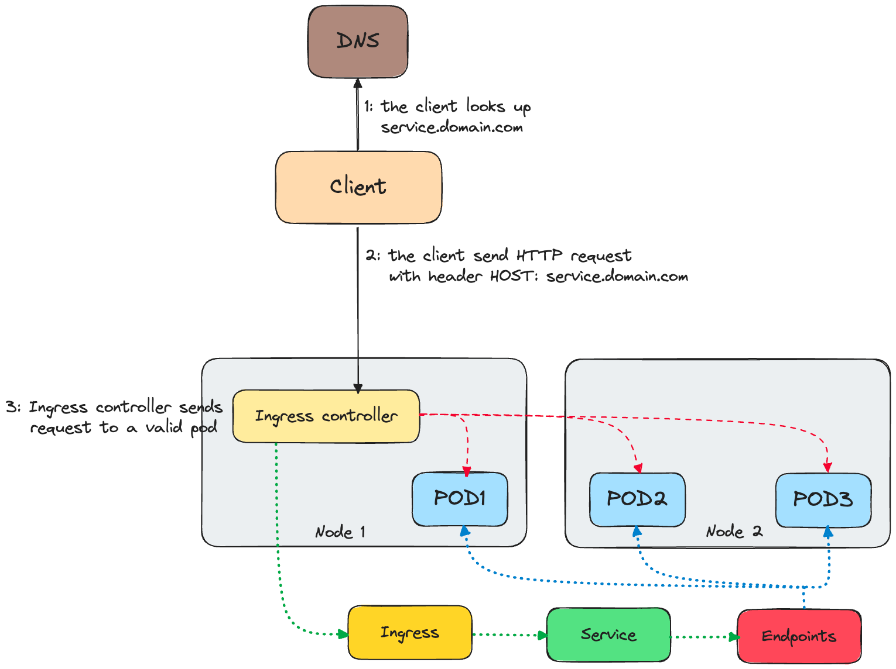

# Services

## What is a service?
A communication between web components must be defined by a certain configuration: for non-Kubernetes application this
is defined by the system administrators that configure each client specifying the exact server IP address or hostname. 
But, for Kubernetes context this cannot work because:  
 - the **pods are ephemeral** so they can be removed and constructed any time on cluster lifecycle
 - the **IP address is assigned to the pod only after schedulation and before the start**, so the client can't know
the IP address up front
 - the **horizontal scaling functionality permits multiple pod to provide the same service** and a client must not be
aware of the number of pods that are backing the service.

So, that is why the **service** exists: it is a Kubernetes resource that permits to define a single, constant entrypoint 
to a group of pods that provide the same service. Each service has a defined IP address and port that must not change
for the whole lifecycle. When a client open a connection to the service IP and port, it will be routed to one of the pods
backing the service. In this way, the client don't needs to know each pod address and the same pods can be freely moved
around the cluster.  
As can be guessed, the Service works also as a *load-balancer* that permits to balance the connections through the free 
pods, exposing a single stable IP address and port. The services uses the label selectors mechanism in order to grouping
the pods, in the same way of the controllers.



A simple structure of a descriptor can be the following:
```yaml
apiVersion: v1
kind: Service
metadata:
  name: service-name
spec:
  ports:
    - port: 80                (port on which the service is available)
      targetPort: 8080        (port on which the pods exposes for service)
  selector:                 
    label: value              (label selector value)
```

For simply show the information related to the service, execute the command:

`$ kubectl get svc`

With the previous descriptor, if multiple calls are made on the service, it will redirect the request to different pods
each time. If is required to send all the request made by a certain client to the same pod, it can be used the tag 
`sessionAffinity` with the value `ClientIP`. If no tag value is defined (as described in the previous descriptor), the 
value is automatically selected as `None`.  

## Networking
Services can also support pods exposition on multiple ports and this can be useful in the case when a pod listen on two 
different ports (i.e. the 8080 for HTTP and 8443 for HTTPS). In this case, the service will define two ports (for example
80 and 443) that forwards to the ports defined in the pod without creating two different services and using a single IP.  
For doing so, simply add multiple `ports` tag in the structure as follows:  

```yaml
apiVersion: v1
kind: Service
metadata:
  name: service-name
spec:
  ports:
    - name: PORT-NAME-1
      port: PORT1                
      targetPort: POD-PORT-NAME1
    - name: PORT-NAME-2
      port: PORT2
      targetPort: POD-PORT-NAME2
  selector:                 
    label: value              
```

If the ports are labelled with a name it is possible to use it as abstractive reference, permitting to reference the same 
port when it will be edited without changing all the port references on the pods.  
When a pod is started, Kubernetes initializes a set of environment variables that points to each service that exists at 
this moment. If a service is created before the pod creation, the started pod can retrieve the IP address and port of the
service by simply inspecting the environment variables. For listing the environment variable, simply execute the command:

`$ kubectl exec POD-NAME env`

The variables that will be extracted contains a prefix that refers to the associated pod. For example, for the pod with 
name `PODNAME`, its environment variables will be `PODNAME_SERVICE_HOST` and `PODNAME_SERVICE_PORT`: the first describe
the host IP address and the second describe the host exposed port.  
In the `kube-system` namespace there is a special pod named `kube-dns` that runs a DNS server on which all the other 
running pods in the cluster are automatically configure to use for name resolving. So, any DNS query performed will
be handled by this pod that works as Kubernetes' own DNS server and that knows all the services running in the system.
Each service gets a DNS entry in the DNS pod and the client pods that know the name of the service will use the **fully
qualified domain name** (also known as **FQDN**) related to the target instead of using the environment variables. 
Obviously, it must know the service port to reach it. A valid FQDN can have the form `pod-name.default.svc.cluster.local` where:  
 - `pod-name` refers to the service name
 - `default` refers to the namespace
 - `svc.cluster.local` refers to the cluster domain suffix used by the services

It is important to remember that services resources works on connection level: all application level's operation such as *cookies*,
*keep-alive connection*, *sessions* and so on cannot be performed by the service itself due to the fact that it is not 
aware of this elements. If a client rely on this things to execute a communication to the always same pod it cannot be
performed correctly and the pods can be utterly interchanged during several communications.  
When a container is started, Kubernetes can be configured to wait a certain amount of delay time before performing the
first **readiness probe check**. After that it invokes the probe periodically and it execute the pod handling accoding
to the readiness probe result. If a pod reports that is not ready, it is removed from the Service and will be re-added
if it become ready again. Unlike liveness probes, if a container fails the readiness check it won't be restarted again.
So, fundamentally a readiness probe permits to make sure that the clients talks always only to healthy pods.



## What is an Endpoints
There are cases on which a pod must access to an external service, outside the Kubernetes cluster. So, instead of having
the service redirect connections to the pods in the cluster, it must be redirected to an external IP and port and for
doing so, it can used a resource called **Endpoints**. It is a list of IP addresses and ports that expose a service.
Although the pod selector is defined in the service descriptor, it’s not used directly for redirecting incoming 
connections. Instead, this selector is used to build a list of IP addresses and ports, which is stored in the Endpoints 
resource. When a client connects to a service, the service proxy selects one of those pair and redirects the incoming 
connection to the server listening at that location.
A simple structure of a descriptor can be the following:

```yaml
apiVersion: v1
kind: Endpoints
metadata:
  name: endpoint-service      
subsets:
  - addresses:
    - ip: 11.11.11.11         (list of target IP addresses)
    - ip: 22.22.22.22         
    ports:
    - port: 80                (target port)
```

For simply show the information related to the service, execute the command:

`$ kubectl get endpoints ENDPOINT-NAME`

Decoupling the service from the endpoint allows them to configure and update separately and manually. This because if a 
service is created without a pod selector, Kubernetes won't create the related endpoint resource. So, the Endpoints resource
needs to have the same name as the service and contains the list of target IP addresses and ports for the same service.
If a container or pod is created after the service creation, it will include the environment variables for the service
and all connections towards this service will be load balanced by the Endpoints.



It is possible to connect directly a set of pods to an external service defining the following descriptor for the service:

```yaml
apiVersion: v1
kind: Service
metadata:
  name: external-service
spec:
  type: ExternalName                         
  externalName: someapi.somedomain.com      
  ports:
  - port: 80
```

In this case, the pods will connect to the external service through the `external-service.default.svc.cluster.local` domain 
name instead of using the service's FQDN. This permits to hide the service name and location from pods, allowing
to modify the service definition or pointing to another service. `ExternalName` are implemented at the DNS level so the 
clients connecting to the service will connect directly to the external service bypassing the service proxy.
For make a service accessible externally, the following operation can be done:
 - **setting the service type to NodePort**
 - **setting the service type to LoadBalancer**
 - **creating an ingress resource**

With a `NodePort` service, a specific port on the node on which is deployed is opened and the incoming requests on that 
port are redirected to the needed service. The service will be accessible by the internal cluster IP and port and also 
by the port opened on all nodes.  
For defining this type of service, the descriptor can be the following:

```yaml
apiVersion: v1
kind: Service
metadata:
  name: service-nodeport
spec:
  type: NodePort             (the type of service for the NodePort kind)
  ports:
  - port: 80                 (target port exposed by the service internal cluster IP)
    targetPort: 8080         (target port of pod)
    nodePort: 38110          (the port exposed on each node)
  selector:
    label: value
```



With a `LoadBalancer` service, the service is accessible through a dedicated load balancer, provisioned from the cloud 
infrastructure on which the Kubernetes system is running on. The load balancer automatically redirects the requests to 
a defined node port across all the nodes on which the pod is deployed. So, the clients will connect to the service 
through the load balancer’s IP at the defined port.  
For defining this type of service, the descriptor can be the following:

```yaml
apiVersion: v1
kind: Service
metadata:
  name: service-loadbalancer
spec:
  type: LoadBalancer                (the type of service for the LoadBalancer kind)
  ports:
  - port: 80
    targetPort: 8080
  selector:
    label: value
```



In order to avoiding unnecessary network hops, it is useful to set a configuration on which the service will redirect
external traffic only to pods running on the node that receive the connection. For doing so, it can be useful to add the
tag `externalTrafficPolicy` on the specs. This can be useful when an external client connects to a service through a node
port and the pod that receive the connection is not running on the same node. It is needed to ensure that the load
balancer forwards the connection only to nodes that have at least one such pod. The drawbacks of this tag is that the 
connection will not be disseminated across all the pods.



Each LoadBalancer service needs its own load balancer with its own public IP address for working well.

## What is an Ingress?
Ingresses are resources that operates at the application layer of the network stack and that works like services but 
providing high level features such as cookie-based session affinity and other advantages that a simple service cannot offer.
A simple structure of a descriptor can be the following:

```yaml
apiVersion: extensions/v1beta1
kind: Ingress
metadata:
  name: ingress-name
spec:
  rules:
  - host: service1.domain.com              (mapping domain to the service)
    http:
      paths:
      - path: /foo                         (requests will be sent to the service foo as routed here)
        backend:
          serviceName: service-name-1     
          servicePort: 80 
      - path: /bar                         (requests will be sent to the service bar as routed here)
        backend:
          serviceName: service-name-1
          servicePort: 80
  - host: service2.domain.com
    http:
      ...
```

For simply show the information related to the service, execute the command:

`$ kubectl get ingresses`

For understand how the Ingress works, lets make an example: the client performs a DNS lookup of `service1.domain.com` domain,
and the DNS server returns the IP of the Ingress controller. The client then sent an HTTP request to the Ingress controller
and specified `service1.domain.com` as value for the `Host` header. The controller uses the value of this header in order 
to find which service the client is trying to access, looking up the pod IPs through the Endpoints object associated 
with the same service. Then it forwards the client’s request to one of the deployed pods. So, the Ingress controller 
didn't forward the request to the service but it will use the controller for selecting a pod.



It is possible to enable the Ingress controller to encrypt communication through TLS: for doing so, it is needed to attach a 
certificate and a private key to the same Ingress. These two resources must be stored in a Kubernetes resource called
Secret and then referenced in the Ingress manifest. First, generate the private key and the certificate:

```bash
$ openssl genrsa -out tls.key 2048
$ openssl req -new -x509 -key tls.key -out tls.cert -days 360 -subj /CN=service.domain.com
```

Then, create the Secret with the two files:

`$ kubectl create secret tls tls-secret --cert=tls.cert --key=tls.key`

For signing the certificate, it is possible to create a `CertificateSigningRequest` resource that does the operation that
must be approved by an human operator. The private key and the certificate are stored in the secret called `tls-secret`.
Then, the Ingress descriptor can be updated including in order to accepts HTTPS requests for `service.domain.com`.

```yaml
apiVersion: extensions/v1beta1
kind: Ingress
metadata:
  name: ingress-name
spec:
  tls:                            
  - hosts:                        
    - service.domain.com           
    secretName: tls-secret        ❸
  rules:
  - host: service.domain.com
    http:
      paths:
      - path: /
        backend:
          serviceName: service-nodeport
          servicePort: 80
```

