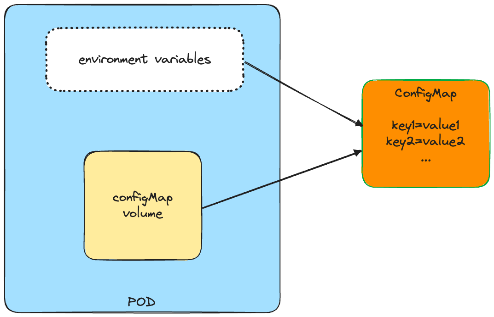
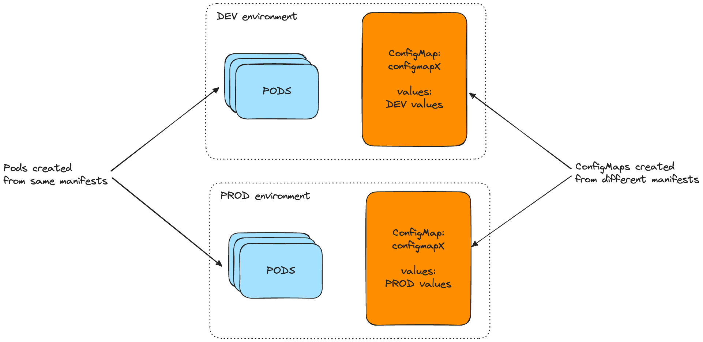
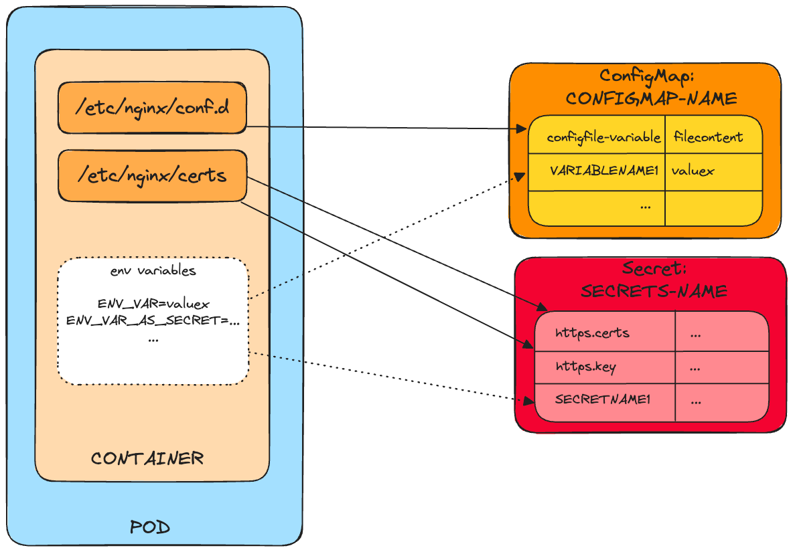

# ConfigMaps and Secrets

##
As viewed before, it is possible to execute a command inside a pod's container. For doing so, it is possible to set an 
instruction in the Dockerfile, composed by `ENTRYPOINT` (which defines the executable invoked when the container is 
started) and by `CMD` (which specifies the arguments that get passed to the ENTRYPOINT). The correct way to execute
those operations is through the `ENTRYPOINT` instruction, specifying the `CMD` instruction if the definition of the 
default arguments is needed. The image can then be run as follows:

`$ docker run <image> <optional-arguments>`

In Kubernetes is possible to use both `ENTRYPOINT` and `CMD`. To do that, the properties `command` and `args` can be set
in the resource descriptor:

```yaml
kind: Pod
spec:
  containers:
  - image: image/name
    command: ["/bin/command"]
    args: ["arg1", "arg2", "arg3"]
```

Containerized applications very often use environment variables in order to customize configuration and Kubernetes permits 
to specify custom variables for each container. 

```yaml
kind: Pod
spec:
 containers:
 - image: image/name
   env:                            
   - name: ENV_VARIABLE_1                
     value: "value1"
   - name: ENV_VARIABLE_12
     value: "$(ENV_VARIABLE_1)2"
...
```

As described, in this descriptor is set a fixed value for the first environment variable and a dynamic one using a 
reference to another environment variables, using the `$(VAR)` syntax. This kind of generation for the environment variables
cannot be extended to generate elements at the pod level and then inherited by its containers.  
Having values hardcoded in the pod definition as before, means that having separate pod definitions for each environment 
is needed. To reuse the same pod definition in multiple environments, is useful to separate the configuration from the 
pod descriptor. This can be done using a **ConfigMap** resource as a source for environment variable values. The ConfigMap
is a map containing several key-value pairs on which can be inserted object that range from short literals to whole 
configuration files. An application doesn't need to read the ConfigMap directly via an explicit connection: the content
of the map is passed to containers as environment variables and so can be referenced in command-line arguments using the
`$(VAR)` syntax.  



The application can directly read the content of a ConfigMap using the Kubernetes REST API endpoint, but this is not
recommended due to the fact that cause the app to be strictly Kubernetes-dependent.
Due to the fact that the pods reference the ConfigMap by name, separating the configuration from the app descriptor 
permits to keep multiple manifests for ConfigMap with the same name but different environment.



To create a ConfigMap, execute this command:

`$ kubectl create configmap CONFIGMAP-NAME --from-literal=variablename1=value1  --from-file=filename`  

For executing an update on the configuration map, execute the command:

`$ kubectl edit configmap CONFIGMAP-NAME`

The ConfigMap can be associated to a pod's environment variable in the app descriptor as follows:

```yaml
apiVersion: v1
kind: Pod
metadata:
  name: pod-name
spec:
  containers:
  - image: image/name
    env:                             
    - name: ENV_VAR              
      valueFrom:                     
        configMapKeyRef:             
          name: CONFIGMAP-NAME      
          key: VARIABLENAME1        
```


If the ConfigMap on which the pod is referenced does not exist when the pod is generated, Kubernetes schedules its 
creation normally and tries to run its containers. The container that references to the non-existing ConfigMap will 
fail to start, but the other container will start normally. If the missing ConfigMap is then created, the failed 
container is started without recreating the pod. In this case, the reference to the ConfigMap can be set as
optional (by setting `configMapKeyRef.optional` property to true) and the container creation can proceed without problem.  
The newer versions of Kubernetes permits to expose all entries of a ConfigMap as environment variables. For doing so,
in the descriptor it is possible to set this:

```yaml
apiVersion: v1
kind: Pod
metadata:
  name: pod-name
spec:
containers:
- image: image/name
  envFrom:                      
    - prefix: APP_PREFIX_         
      configMapRef:               
        name: CONFIGMAP-NAME
...
```

It is possible to specify a prefix for the environment variables with `envFrom.prefix` tag. Doing so permits to add a 
common way to categorize the variables dedicated to certain pod. Applying all this stuff in order to set an environment
variable on pod command, the result can be the follows:

```yaml
apiVersion: v1
kind: Pod
metadata:
  name: pod-name
spec:
  containers:
  - image: image/name
    env:                               
    - name: ENV_VAR                   
      valueFrom:                       
        configMapKeyRef:
          name: CONFIGMAP-NAME
          key: VARIABLENAME1
    args: ["$(ENV_VAR)"]
```

One of the most important features of the containers is their immutability over the time. This permits to don't have
difference between multiple running containers generated from the same image. But if a ConfigMap is updated adding another
element, some pods that does not permits reload configuration can be different from other instances until they will be
restarted. So, remember this all the times it is needed to update a configuration variable.

### What is a Secrets resource?
All the information saved in the ConfigMap and passed to the container are regular non-sensitive information that does not
need to be kept secure. But there are circumstances where it is needed to add a secret information such as credentials or
encryption keys: to store those elements it is better to use Kubernetes **Secret** resource. They are very similar to 
ConfigMaps (they also store a set of key-value pairs) but provide more strong security on access and read.  
The best advantage of Secrets resource is that the secrets are only distributed to the nodes that run the pods that
need to explicitly access the secret values. Also, Secrets are always stored in memory and are never written in physical
storage.  
Before the version 1.7, Kubernetes used to store secrets on the master node in the *etcd* component in an unencrypted form.
This means that the master node needs to be secured avoiding unwanted accesses in order to keep the sensitive data 
securely stored. From the version 1.7 the *etcd* stores Secrets in encrypted form so no more redundant master node
security is needed.  
To create a Secrets resource, execute this command:

`$ kubectl create secret generic SECRETS-NAME --from-file=SECRETS-FILE`

For retrieving the Secrets resource, execute the command:

`$ kubectl get secrets`

The Secret can be generated with the following descriptor:

```yaml
apiVersion: v1
kind: Secret
stringData:                                    
  VAR_PLAIN_TEXT: plain_text_value
data:
  VAR_ENCRYPT: LS0tLS1CRUdJTiBDRVJUSUZJQ0FURS0tLS0tCk1JSURCekNDQ...
```

Generally, the content of a Secret's entry is shown as Base64-encoded string, differently from ConfigMap where the elements 
are stored as plain text. The Base64 encoding permits to include binary data (of maximum size of 1MB) either in YAML or 
JSON without character escaping errors. If a plain text secret is needed, it can be stored as a plain test with `stringData` tag.
The `stringData` field permits to define a *write-only* secret that is used only to define the values of the secrets. This
secrets will not be shown when the Secrets' descriptor YAML is required but will be included as Base64-encoded information
in the `data` tag.  
When a secret is needed, the value of the entry is decoded and then written to the file in its real form. So, the app 
doesn't needs to decode the secret and it must only read the file or look-up the environment variable.

#### Figure 7.12. Combining a ConfigMap and a Secret to run your fortune-https pod


It is possible to expose individual entries from `secret` tag as environment variable in the following way:

```yaml
apiVersion: v1
kind: Pod
metadata:
  name: pod-name
spec:
  containers:
  - image: image/name
    env:                               
    - name: ENV_VAR_AS_SECRET                   
      valueFrom:
        secretKeyRef:
          name: SECRETS-NAME
          key: SECRETNAME1
    args: ["$(ENV_VAR_AS_SECRET)"]
```

